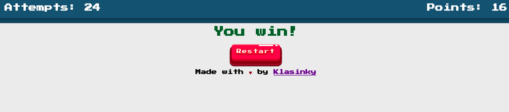

# Memory Game

The classic memory game (Match The pairs) created in React.



You can play it by clicking [Here!](https://klasinky.github.io/memory-game/)

## Installation

Clone the repository
```
git clone https://github.com/klasinky/memory-game
```

Then run the following commands

```
npm i
```
```
npm run start
```